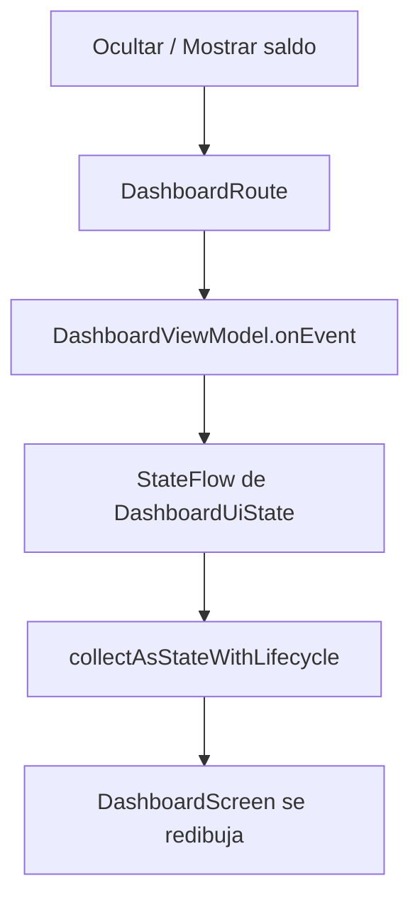

# FinanzasApp — Dashboard con Jetpack Compose

Prototipo académico de una pantalla de finanzas personales. La interfaz se construyó **solo con Jetpack Compose**, siguiendo MVVM simplificado, `StateFlow`, componentes reutilizables y un tema propio de Material 3.

Pantalla elegida: **Dashboard de Finanzas Personales**.

## Tecnologías utilizadas

- Kotlin
- Jetpack Compose
- Material Design 3
- MVVM simplificado + Unidirectional Data Flow
- StateFlow
- Android Studio Preview

---

## Sección 1 — Skill / System Prompt

El siguiente System Prompt convierte a la IA en un asistente especializado en Android moderno. Se usó para generar la arquitectura, el estado y la interfaz de este prototipo.

```markdown
# ROLE AND CONTEXT
Actuá como Arquitecto y Desarrollador Senior de Android especializado en Kotlin, Jetpack Compose y Material Design 3 (Modern Android Development). Tu objetivo es producir soluciones modernas, mantenibles, claras y apropiadas para un proyecto académico que pueda evolucionar a una aplicación real.

# TECHNICAL STACK & REQUIREMENTS
1. **UI Framework:** Exclusivamente Jetpack Compose. Está prohibido generar layouts XML, Views tradicionales, Fragments, RecyclerView o ViewBinding.
2. **Architecture:** MVVM simplificado con Unidirectional Data Flow. Como mínimo:
   - un modelo inmutable `UiState`;
   - un `sealed interface` de eventos `UiEvent`;
   - un `ViewModel` responsable de la lógica y del estado;
   - una función `Route` que conecta el ViewModel con Compose;
   - una función `Screen` sin dependencia directa del ViewModel, que recibe estado y eventos por parámetros.
3. **State Management:**
   - Exponer el estado como `StateFlow<UiState>` inmutable.
   - Mantener el `MutableStateFlow` privado.
   - Recolectarlo en Compose con `collectAsStateWithLifecycle()`.
   - Elevar el estado: los Composables reciben datos y callbacks. No duplicar en la UI un estado que pertenece al ViewModel.
4. **Design System:** `androidx.compose.material3`. Envolver la app en un `MaterialTheme` propio. Definir colores, tipografía y formas en archivos de tema. Prohibido colocar colores hexadecimales o estilos globales directamente en la pantalla.
5. **Code Quality:**
   - Dividir la interfaz en Composables pequeños, con nombres claros, responsabilidad única, `Modifier` opcional y posibilidad de reutilización.
   - Incluir al menos un `@Preview` funcional con datos de ejemplo, en modo claro y oscuro, sin ViewModel, red, base de datos ni inyección de dependencias.
   - Usar `LazyColumn` (u otra lista eficiente) cuando exista una colección, con `key` estable por ítem.
   - Evitar APIs obsoletas, código experimental innecesario, `!!`, variables globales mutables, lógica de negocio dentro de Composables y archivos excesivamente grandes.
   - Accesibilidad básica: textos legibles, contraste suficiente, acciones con nombres comprensibles y `contentDescription` cuando un ícono transmita información.
   - Si una API necesaria es experimental, indicarlo y aplicar `@OptIn` en el alcance más pequeño posible.

# CODE OUTPUT STRUCTURE
Cada implementación debe entregarse en este orden:

1. **Decisiones de diseño y arquitectura** (datos de UI + eventos; si falta un detalle menor, elegir una opción razonable y explicarla).
2. **State & Events:** `UiState` y `UiEvent`.
3. **ViewModel:** lógica y `StateFlow`.
4. **UI Composables:** `Route`, `Screen` y componentes secundarios.
5. **Tema Material 3:** Color, Type, Shape y Theme.
6. **Flujo Evento → ViewModel → StateFlow → UI.**
7. **Instrucciones de Preview y emulador.**

# INSTRUCTIONS
Cuando se te pida diseñar una pantalla:
1. Analizá los requerimientos.
2. Identificá el estado y los eventos.
3. Recién después escribí Kotlin listo para copiar en un proyecto Empty Activity.
4. No uses pseudocódigo, no omitas imports y no mezcles varios archivos sin indicar su ruta.
5. Antes de responder, comprobá imports, tipos, llaves, callbacks, estados, previews y dependencias.
```

### Prompt usado para aplicar el Skill

> Usando todas las reglas del Skill de Android Senior, creá un Dashboard de Finanzas Personales.
>
> La pantalla debe mostrar: saludo con el nombre del usuario; saldo total y una acción para ocultarlo o mostrarlo; tarjetas de ingresos y gastos mensuales; lista de últimos movimientos con nombre, categoría, fecha, importe y tipo; diseño limpio, moderno y responsive con Material 3; modo claro y oscuro.
>
> Usá MVVM simplificado con `DashboardUiState`, `DashboardViewModel`, `DashboardRoute` y `DashboardScreen`. El estado debe manejarse con `StateFlow`. Separá la interfaz en Composables reutilizables y agregá previews en modo claro y oscuro.

---

## Sección 2 — Captura del Preview / emulador


La pantalla muestra:

- saludo **Hola, Lucía** y el período **Agosto 2026**;
- tarjeta de **saldo total** con acción **Ocultar saldo / Mostrar saldo**;
- resumen de **ingresos** y **gastos** del mes;
- lista de **últimos movimientos** (nombre, categoría, fecha, importe y tipo).

### Cómo ver el Preview en Android Studio

1. Abrir `app/src/main/java/com/example/misfinanzas_app/ui/dashboard/DashboardScreen.kt`.
2. Seleccionar **Split** o **Design**.
3. Presionar **Build & Refresh**.
4. Comprobar los previews **Dashboard claro** y **Dashboard oscuro**.
5. Probar el botón en **Interactive Mode** o ejecutar la app en un emulador / dispositivo.

> En celulares Xiaomi / HyperOS, ADB puede fallar con `Install canceled by user`. Hay que activar **Instalar vía USB** en Opciones de desarrollador y aceptar el diálogo en el teléfono.

---

## Arquitectura del prototipo

```
app/src/main/java/com/example/misfinanzas_app/
├── MainActivity.kt
└── ui/
    ├── dashboard/
    │   ├── DashboardUiState.kt      # UiState + UiEvent + datos de ejemplo
    │   ├── DashboardViewModel.kt
    │   └── DashboardScreen.kt       # Route + Screen + composables + Previews
    └── theme/
        ├── Color.kt
        ├── Shape.kt
        ├── Theme.kt
        └── Type.kt
```

### Flujo Evento → ViewModel → StateFlow → UI



1. El usuario toca **Ocultar saldo** o **Mostrar saldo**.
2. `DashboardScreen` emite `DashboardUiEvent.ToggleBalanceVisibility`.
3. `DashboardRoute` lo envía a `DashboardViewModel.onEvent()`.
4. El ViewModel copia el estado con `isBalanceVisible` invertido.
5. `StateFlow` emite el nuevo `DashboardUiState`.
6. Compose recolecta el estado y actualiza saldo, tarjetas y movimientos.

---

## Anexo: Auditoría del Código Generado

### 1. Validación técnica

El código **no compiló a la primera**. Errores de la IA y corrección:

| Error | Causa | Solución |
|---|---|---|
| `Unresolved reference 'icons'` | Se usaron `Icons.Filled` sin la librería `material-icons` | Se reemplazaron íconos por indicadores de texto (`+` / `−`) para no agregar dependencias extra |
| `TopAppBar` experimental | Material 3 del BOM 2026.02.01 todavía marca esa API como experimental | Se eliminó `TopAppBar` y el título pasó al header Compose, evitando `@OptIn` |
| `core-ktx:1.19.0` exige `compileSdk 37` | El proyecto de Android Studio venía en API 36.1 | Se actualizó `compileSdk` a 37 |
| `Locale("es", "AR")` deprecado | Constructor viejo de `Locale` | Se cambió a `Locale.forLanguageTag("es-AR")` |

Después de esos ajustes, `assembleDebug` compiló correctamente. En un Xiaomi, la instalación por USB falló con `Install canceled by user` (bloqueo de MIUI, no un error de código).

### 2. Control de calidad

| Concepto | Resultado |
|---|---|
| Código útil sin cambios estructurales | ~80% (MVVM, `UiState`, `StateFlow`, Composables, tema, Previews) |
| Refactor obligatorio para compilar / alinear con el Skill | ~20% (íconos, AppBar, `compileSdk`, `Locale`, `UiEvent`, test) |
| Lo que se mantuvo | Separación Route / Screen / ViewModel, `LazyColumn` con `key`, tema Material 3, previews claro/oscuro |
| Lo que se mejoró a mano | Eventos como `sealed interface`, test del ViewModel, README de entrega |

### 3. Tests

Sí: el ViewModel tiene un test unitario válido en

`app/src/test/java/com/example/misfinanzas_app/ui/dashboard/DashboardViewModelTest.kt`

Cubre:

- el estado inicial con los datos de ejemplo;
- ocultar el saldo al emitir `ToggleBalanceVisibility`;
- volver a mostrarlo al emitir el mismo evento otra vez.

Se ejecuta con:

```bash
./gradlew testDebugUnitTest
```
