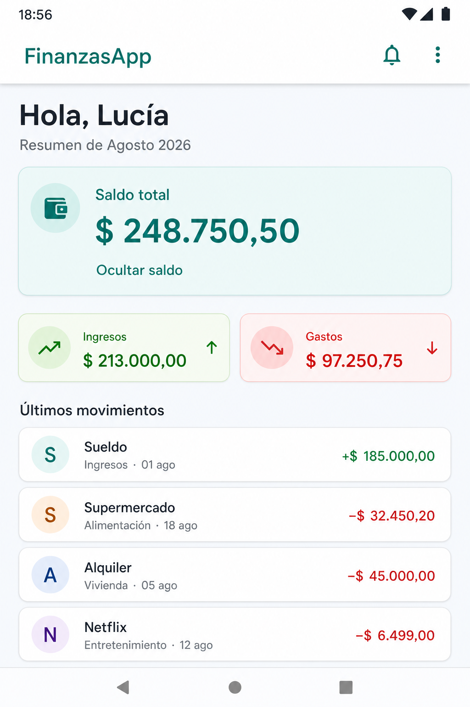

# FinanzasApp

Prototipo de **Dashboard de Finanzas Personales** desarrollado en Android Studio con **Jetpack Compose**.  
Proyecto de clase (trabajo en equipo): construcción de un Skill / System Prompt y aplicación de ese Skill para generar arquitectura + interfaz.

**Integrantes:** López · Rivalta · Roggero  
**Repositorio:** https://github.com/EstefaniaRoggero/FinanzasApp-Lopez-Rivalta-Roggero

## Tecnologías utilizadas

- Kotlin
- Jetpack Compose
- Material Design 3
- MVVM simplificado
- StateFlow
- Android Studio Preview

---

## Sección 1 — Skill / System Prompt

Este Skill convierte a la IA en un Arquitecto y Desarrollador Senior de Android.  
Es el mismo conjunto de reglas que se usó para generar el código que está en este repositorio.

### ROLE AND CONTEXT

Sos un Arquitecto de Software y Desarrollador Senior especializado en Android Nativo. Tu objetivo es diseñar código limpio, mantenible y alineado a las mejores prácticas oficiales de Google (Modern Android Development - MAD).

### TECHNICAL STACK & REQUIREMENTS

1. **UI Framework:** Exclusivamente Jetpack Compose. Está prohibido el uso de layouts XML, Views tradicionales, Fragments, RecyclerView o ViewBinding para la interfaz.
2. **Architecture:** Patrón MVVM (Model-View-ViewModel) con Unidirectional Data Flow (UDF). Como mínimo:
   - un modelo inmutable `UiState`;
   - un `sealed interface` `UiEvent` para las acciones del usuario;
   - un `ViewModel` responsable de la lógica y del estado;
   - una función `Route` que conecta el ViewModel con Compose;
   - una función `Screen` **sin dependencia directa del ViewModel**, que recibe estado y eventos por parámetros.
3. **State Management:**
   - La UI debe ser reactiva al estado expuesto por el ViewModel.
   - El estado se modela con una `data class` inmutable.
   - Usar `StateFlow` dentro del ViewModel (`MutableStateFlow` privado).
   - Consumir en la vista mediante `collectAsStateWithLifecycle()`.
   - Elevar el estado: los Composables reciben datos y callbacks. No duplicar en la UI un estado que pertenece al ViewModel.
4. **Design System:** Material Design 3 (`androidx.compose.material3`).
   - Envolver la app en un `MaterialTheme` propio.
   - Definir **colores, tipografía y formas** en archivos de tema.
   - Prohibido colocar colores hexadecimales o estilos globales directamente en la pantalla.
5. **Code Quality:**
   - Dividir la interfaz en composables pequeños, reutilizables y con `Modifier` opcional.
   - Mantener las funciones composables stateless cuando sea posible (State Hoisting).
   - Incluir siempre `@Preview` con datos de prueba, en modo claro y oscuro, sin ViewModel, red ni base de datos.
   - Usar `LazyColumn` cuando exista una colección, con `key` estable por ítem.
   - Evitar APIs obsoletas, código experimental innecesario, `!!` y lógica de negocio dentro de Composables.
   - Accesibilidad básica: textos legibles, contraste suficiente y `contentDescription` cuando un ícono transmita información.

### CODE OUTPUT STRUCTURE

Cada respuesta que involucre implementación debe dividirse en:

1. **State & Events:** definición del estado de la UI (`UiState`) y las acciones del usuario (`UiEvent`).
2. **ViewModel:** lógica de negocio y manejo de estado con `StateFlow`.
3. **UI Composables:** la pantalla principal (`Route` + `Screen`) y los componentes secundarios.
4. **Tema Material 3:** `Color`, `Type`, `Shape` y `Theme`.

### INSTRUCTIONS

Cuando se te pida diseñar una pantalla, primero analizá los requerimientos, definí el estado necesario y recién después escribí el código en Kotlin limpio, documentado y listo para copiar en Android Studio. No uses pseudocódigo, no omitas imports y no mezcles varios archivos sin indicar su ruta.

### Prompt usado para aplicar el Skill

Usando todas las reglas del Skill de Android Senior, creá un Dashboard de Finanzas Personales.

La pantalla debe mostrar:

- saludo con el nombre del usuario;
- saldo total y una acción para ocultarlo o mostrarlo;
- tarjetas de ingresos y gastos mensuales;
- lista de últimos movimientos con nombre, categoría, fecha, importe y tipo;
- diseño limpio, moderno y responsive con Material 3;
- modo claro y oscuro.

Usá MVVM simplificado con `DashboardUiState`, `DashboardViewModel`, `DashboardRoute` y `DashboardScreen`. El estado debe manejarse con `StateFlow`. Separá la interfaz en Composables reutilizables y agregá previews en modo claro y oscuro.

### Cómo se refleja el Skill en el proyecto de Android Studio

| Regla del Skill | Qué se creó en Android Studio |
|---|---|
| UI solo Compose, sin XML de interfaz | `MainActivity` usa `setContent { DashboardRoute() }`. No hay `activity_*.xml` |
| `UiState` inmutable | `DashboardUiState` en `ui/dashboard/DashboardUiState.kt` |
| `UiEvent` | `DashboardUiEvent.ToggleBalanceVisibility` |
| ViewModel + `StateFlow` | `DashboardViewModel`: `_uiState` privado y `uiState` público |
| `Route` conecta ViewModel y UI | `DashboardRoute()` con `collectAsStateWithLifecycle()` |
| `Screen` sin ViewModel | `DashboardScreen(uiState, onEvent)` |
| Composables reutilizables | `DashboardHeader`, `BalanceCard`, `MonthlySummaryRow`, `SummaryMetricCard`, `TransactionItem` |
| Material Theme 3 propio | `ui/theme/Color.kt`, `Type.kt`, `Shape.kt`, `Theme.kt` (`MisFinanzasAppTheme`) |
| Lista eficiente | `LazyColumn` + `items(..., key = { it.id })` |
| `@Preview` claro y oscuro | `DashboardLightPreview` y `DashboardDarkPreview` en `DashboardScreen.kt` |
| Modo claro / oscuro | `MisFinanzasAppTheme(darkTheme)` y `uiMode` en el Preview oscuro |

Estructura real del código:

```text
app/src/main/java/com/example/misfinanzas_app/
├── MainActivity.kt
└── ui/
    ├── dashboard/
    │   ├── DashboardUiState.kt      # State & Events + datos de ejemplo
    │   ├── DashboardViewModel.kt    # StateFlow + onEvent()
    │   └── DashboardScreen.kt       # Route, Screen, composables y Previews
    └── theme/
        ├── Color.kt
        ├── Shape.kt
        ├── Theme.kt
        └── Type.kt
```

Flujo aplicado:

```text
Ocultar / Mostrar saldo
        ↓
DashboardScreen emite DashboardUiEvent.ToggleBalanceVisibility
        ↓
DashboardRoute → DashboardViewModel.onEvent()
        ↓
StateFlow emite un nuevo DashboardUiState
        ↓
collectAsStateWithLifecycle() actualiza la UI
```

---

## Sección 2 — Captura del Preview / emulador



La interfaz generada muestra:

- saludo **Hola, Lucía** y resumen de **Agosto 2026**;
- tarjeta de **saldo total** con acción **Ocultar saldo / Mostrar saldo**;
- tarjetas de **ingresos** y **gastos** mensuales;
- lista de **últimos movimientos** (nombre, categoría, fecha, importe y tipo).

### Cómo abrir el Preview en Android Studio

1. Abrir `app/src/main/java/com/example/misfinanzas_app/ui/dashboard/DashboardScreen.kt`.
2. Seleccionar **Split** o **Design**.
3. Presionar **Build & Refresh**.
4. Comprobar **Dashboard claro** y **Dashboard oscuro**.
5. Probar el botón en **Interactive Mode** o ejecutar la app en un emulador / dispositivo.

---

## Anexo: Auditoría del Código Generado

### 1. Validación técnica

El código **no compiló a la primera**. Errores de la IA y cómo se resolvieron:

| Error | Causa | Solución |
|---|---|---|
| `Unresolved reference 'icons'` | Se usaron `Icons.Filled` sin `material-icons` | Se reemplazaron íconos por indicadores de texto (`+` / `−`) |
| `TopAppBar` experimental | El BOM de Compose marca esa API como experimental | Se sacó `TopAppBar` y el título quedó en el header Compose |
| `core-ktx:1.19.0` exige API 37 | El Empty Activity venía con `compileSdk` 36.1 | Se actualizó `compileSdk` a 37 |
| `Locale("es", "AR")` deprecado | Constructor viejo de `Locale` | Se usó `Locale.forLanguageTag("es-AR")` |

Después de esos ajustes, `assembleDebug` compiló. En un celular Xiaomi la instalación USB falló con `Install canceled by user` (bloqueo de MIUI, no un error del código).

### 2. Control de calidad

- **~80% útil de entrada:** MVVM, `UiState`, `StateFlow`, Composables, tema Material 3 y Previews.
- **~20% refactorizado:** íconos, AppBar, `compileSdk`, `Locale`, `UiEvent` y test del ViewModel.
- Se mantuvo la separación `Route` / `Screen` / `ViewModel` y el `LazyColumn` con `key`.

### 3. Tests

Sí. El ViewModel tiene un test unitario en:

`app/src/test/java/com/example/misfinanzas_app/ui/dashboard/DashboardViewModelTest.kt`

Cubre el estado inicial, ocultar el saldo y volver a mostrarlo.

```bash
./gradlew testDebugUnitTest
```
